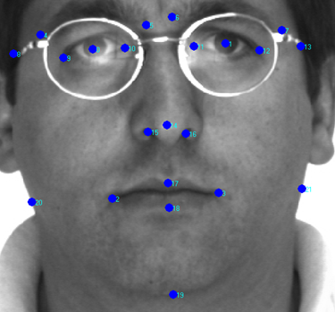

# Face-Prediction
Predicting gender/expression/persons from coordinates extracted from facial imaging 

See FaceMarkupARDatabase.zip for dataset, instructions, and more detailed description

# Dataset contains the following:

Male images are stored as: M-xx-yy.raw

Females as: F-xx-yy.raw

'xx' is a unique person identifier (from "00" to "70" for males and from "00" to "56" for females)

'yy' specifies the features of each image; its meanings are described at the following table:

1 : Neutral expression

2 : Smile

3 : Anger

4 : Scream

5 : left light on

# Here is an example of one sample:
version: 1
n_points: 22
{
328.444 275.496
434.921 275.029
331.713 401.121
427.449 400.187
271.936 270.826
356.464 254.014
388.221 255.882
494.698 268.491
263.997 274.095
301.825 277.831
349.459 277.364
411.104 278.298
459.673 277.831
515.246 276.897
368.606 340.41
355.53 351.151
391.957 350.217
374.253 395.527
374.253 416.925
373.276 483.314
280.342 404.39
499.835 402.522
}

# Features
1.	Eye length ratio: length of eye (maximum of two) over distance between points 8 and 13.
2.	Eye distance ratio: distance between center of two eyes over distance between points 8 and 13.
3.	Nose ratio: Distance between points 15 and 16 over distance between 20 and 21.
4.	Lip size ratio: Distance between points 2 and 3 over distance between 17 and 18.
5.	Lip length ratio: Distance between points 2 and 3 over distance between 20 and 21.
6.	Eye-brow length ratio: Distance between points 4 and 5 (or distance between points 6 and 7 whichever is larger) over distance between 8 and 13.
7.	Aggressive ratio: Distance between points 10 and 19 over distance between 20 and 21.

# Machine Learning Techniques
Used KNN, ANN, Naive Bayes, Decision Tree, and SVM to compare features against Persons/Expressions/Gender 

